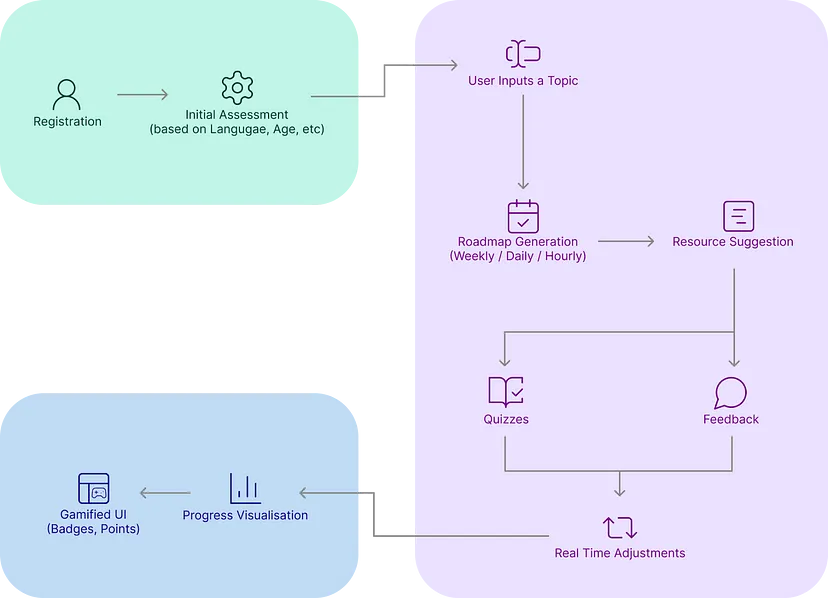

# 🎓 TeamMatrix — AI-Powered Personalized Learning Platform

<div align="center">

  

  ### *Learn Anything, Anytime — Customized to Your Goals, Pace, & Language.*

  [](https://reactjs.org/)
  [](https://flask.palletsprojects.org/)
  [](https://ai.google.dev/)
  [](LICENSE)

  [**Explore Features**](#-key-features) • [**System Architecture**](#-system-architecture) • [**Getting Started**](#-getting-started) • [**API Reference**](#-api-endpoints) • [**Demo Video**](#-demo-video)

</div>

---

## 📌 Overview

**TeamMatrix** (LearnX) is a next-generation web-based educational platform that delivers **hyper-personalized learning roadmaps**, **interactive AI-generated quizzes**, and **tailored study resources** based on each user's unique background, target schedule, language preference, and knowledge level.

Whether you're starting from scratch as an *Absolute Beginner* or sharpening your skills as an *Advanced Professional*, TeamMatrix leverages **Google Gemini 3.6 Flash** to curate step-by-step curricula, track your weekly progress, evaluate concept mastery, and seamlessly adapt study plans in real-time.

---

## ✨ Key Features

- 🗺️ **Dynamic AI Roadmap Generation**  
  Enter any topic (e.g., *Machine Learning*, *Quantum Computing*, *Web Development*), specify your timeframe and weekly availability, and receive a weekly structured learning roadmap with time estimates and detailed subtopics.

- 🧠 **Interactive Concept Quizzes**  
  Test your understanding at the end of subtopics with AI-generated multiple-choice questions complete with instant feedback, scoring, and step-by-step explanation rationales.

- 📚 **Generative AI Study Resources & Tutor**  
  Generate instant study guides, breakdown of key concepts, step-by-step objectives, common pitfalls, and self-assessment checklists for any subtopic.

- 🌐 **Multilingual Learning Support**  
  Translate learning roadmaps and study material into your preferred target language on the fly using integrated AI translation.

- ⚡ **Zero-Downtime Offline Fallback Engine**  
  Equipped with a robust local fallback system that ensures uninterrupted user experience even if API quotas are reached or network connectivity drops.

- 📊 **Progress Analytics & Profile Dashboard**  
  Monitor your active courses, completed milestones, streak progress, and learning statistics visually with dynamic charts and confetti celebration effects.

---

## 🎬 Demo Video

Watch TeamMatrix in action:

[](https://www.youtube.com/watch?v=v-dP18RBArc "TeamMatrix / LearnX Demo Video")

> 📺 [Click here to watch the full demo on YouTube](https://www.youtube.com/watch?v=v-dP18RBArc)

---

## 🖼️ User Interface & Platform Screenshots

<div align="center">

### 1. Dashboard & Profile Progress


### 2. Personalized Learning Roadmap View


### 3. Topic Input & Configuration


### 4. Interactive Quiz & Assessment


</div>

---

## 🏗️ System Architecture & Workflow

TeamMatrix connects a modular **React Single Page Application (SPA)** frontend with a **Flask REST API** backend powered by **Google Gemini 3.6 Flash**.



### Core User Flow:
1. **Input Phase**: User specifies a topic, duration, knowledge level, and weekly study hours.
2. **AI Processing**: Flask backend requests Gemini 3.6 Flash to format structured JSON curricula (or uses local fallback engines).
3. **Interactive Learning**: User navigates topics, requests AI study resources, and completes interactive assessments.
4. **Adaptive Feedback**: Quiz performance updates completion state and triggers visual progress tracking.

---

## 🛠️ Tech Stack

| Domain | Technologies Used |
| :--- | :--- |
| **Frontend** | React 18, React Router DOM v6, Axios, Lucide React, Chart.js (`react-chartjs-2`), React Confetti Explosion, React Markdown, CSS3 |
| **Backend** | Python 3, Flask 3.0, Flask-CORS, `python-dotenv` |
| **AI & LLM** | Google Gemini 3.6 Flash (`google-generativeai` SDK), Custom Fallback Engine |
| **Styling & Assets** | Custom Glassmorphic CSS Design System, Responsive Components |

---

## 🚀 Getting Started

Follow these steps to set up TeamMatrix locally on your machine.

### Prerequisites
- **Node.js** (v16.0 or higher) & **npm**
- **Python** (v3.9 or higher) & `pip`
- **Google Gemini API Key** (Get your free key at [Google AI Studio](https://ai.google.dev/aistudio))

---

### 1. Clone the Repository
```bash
git clone https://github.com/shagunagg12/TeamMatrix.git
cd TeamMatrix
```

---

### 2. Backend Setup

1. Navigate to the backend directory:
   ```bash
   cd backend
   ```

2. Create and activate a Python virtual environment:
   - **Windows:**
     ```powershell
     python -m venv humanaize
     .\humanaize\Scripts\activate
     ```
   - **macOS / Linux:**
     ```bash
     python3 -m venv humanaize
     source humanaize/bin/activate
     ```

3. Install required Python packages:
   ```bash
   pip install -r requirements.txt
   ```

4. Create a `.env` file inside the `./backend` directory:
   ```env
   GEMINI_API_KEY=your_gemini_api_key_here
   ```

5. Return to the root directory:
   ```bash
   cd ..
   ```

---

### 3. Frontend Setup

1. Install frontend dependencies in the project root:
   ```bash
   npm install
   ```

---

### 4. Running the Application

Start both the backend server and frontend server:

#### Terminal 1: Backend Server (Flask)
```bash
npm run backend
# Starts backend server at http://localhost:5000
```
*Alternatively:*
```bash
cd backend
python base.py
```

#### Terminal 2: Frontend Server (React)
```bash
npm start
# Starts frontend app at http://localhost:3000
```

---

## 📡 API Endpoints

The Flask backend provides RESTful JSON endpoints:

| Endpoint | Method | Payload Example | Description |
| :--- | :--- | :--- | :--- |
| `/api/roadmap` | `POST` | `{"topic": "Machine Learning", "time": "4 weeks", "knowledge_level": "Beginner"}` | Returns weekly roadmap JSON with subtopics & descriptions |
| `/api/quiz` | `POST` | `{"course": "Python", "topic": "Functions", "subtopic": "Lambda", "description": "..."}` | Generates 5 multiple-choice quiz questions with answer rationale |
| `/api/generate-resource` | `POST` | `{"course": "ML", "knowledge_level": "Beginner", "description": "...", "time": "3h"}` | Generates markdown learning study guide and tutor resources |
| `/api/translate` | `POST` | `{"textArr": ["Hello", "Welcome"], "toLang": "Spanish"}` | Translates list of strings into target language |

---

## 📁 Repository Structure

```
TeamMatrix/
├── backend/
│   ├── base.py                 # Flask API routes & CORS handling
│   ├── roadmap.py              # Gemini AI roadmap generator & offline fallback
│   ├── quiz.py                 # Gemini AI quiz generator & fallback questions
│   ├── generativeResources.py  # AI study guide tutor generator
│   ├── translate.py            # Multilingual AI translation module
│   └── requirements.txt        # Python backend dependencies
├── public/                     # Static assets, branding logo & screenshots
│   ├── logo.png
│   ├── process_flow.png
│   ├── image.png - image-3.png
│   └── index.html
├── src/
│   ├── components/             # Reusable UI components (Headers, Loaders, Modals)
│   ├── pages/                  # Main views (Input Topic, Roadmap, Quiz, Profile)
│   ├── App.js                  # Application root
│   ├── index.js                # React Router setup & entry point
│   └── index.css               # Global styles & design system
├── package.json                # React project config & scripts
└── README.md                   # Project documentation
```

---

## 🤝 Contributing

Contributions, issues, and feature requests are welcome!  
Feel free to check out the [issues page](https://github.com/shagunagg12/TeamMatrix/issues).

1. Fork the Project
2. Create your Feature Branch (`git checkout -b feature/AmazingFeature`)
3. Commit your Changes (`git commit -m 'Add some AmazingFeature'`)
4. Push to the Branch (`git push origin feature/AmazingFeature`)
5. Open a Pull Request

---

## 📄 License

Distributed under the MIT License. See `LICENSE` for more information.

<div align="center">
  <sub>Built with ❤️ by Team Matrix for the HCL Amplified Hackathon.</sub>
</div>