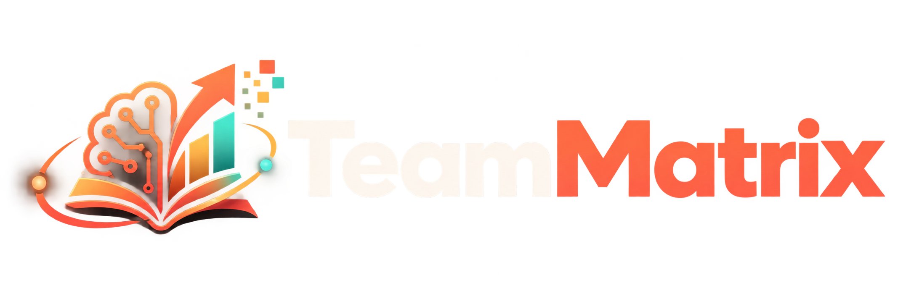
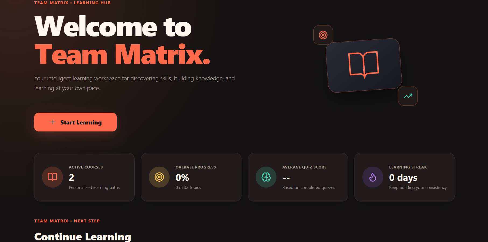
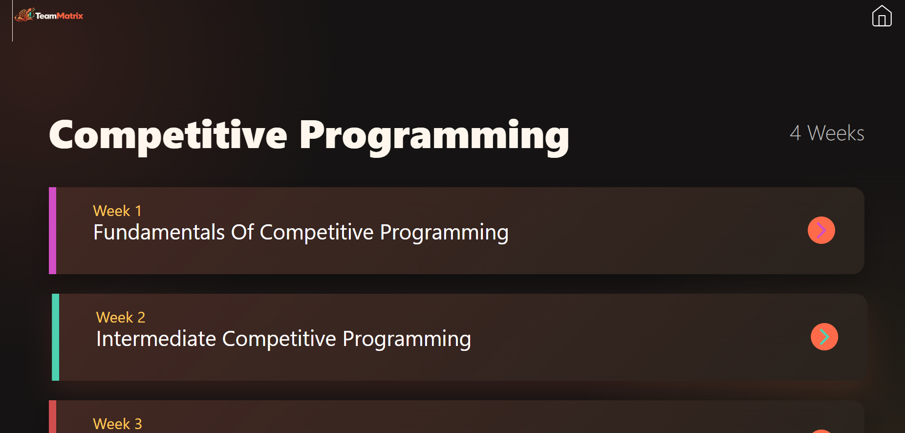
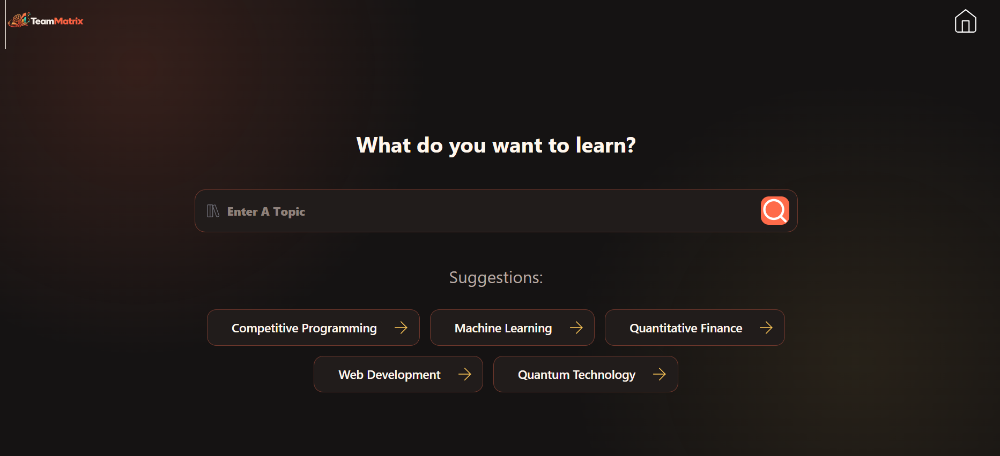
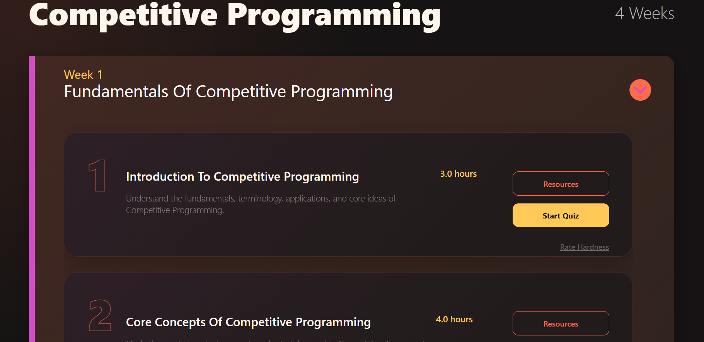

# 🎓 TeamMatrix

<div align="center">



## AI-Powered Personalized Learning Platform

**Turn your learning goals into a personalized roadmap, learn with AI-generated resources, test your knowledge, and track your progress — all in one place.**

<br/>

<a href="https://teammatrix-y4v9.onrender.com/">
  
</a>

<a href="https://github.com/Ashish-bytes/TeamMatrix">
  
</a>

<a href="https://www.youtube.com/watch?v=aNwq-aMi46g">
  
</a>

<br/><br/>


</div>

---

## 🌐 Live Project

### 🚀 Try TeamMatrix

**Live Application:**
https://teammatrix-y4v9.onrender.com/

TeamMatrix is deployed as a full-stack web application with a React frontend and Flask backend.

> **Note:** AI-generated functionality depends on the configured Google Gemini API credentials and service availability. The application also includes fallback logic for supported functionality.

---

# 📌 About The Project

**TeamMatrix** is an AI-powered personalized learning platform that helps users create structured learning journeys based on their:

* 🎯 Learning goal
* 📚 Knowledge level
* ⏱️ Available time
* 📅 Learning duration
* 🕐 Weekly study hours
* 🌍 Preferred language

Traditional learning platforms often provide the same curriculum to every learner.

**TeamMatrix takes a different approach.**

It uses AI to transform a learner's individual requirements into a structured roadmap containing topics, subtopics, estimated learning time, study resources, quizzes, and progress tracking.

### The goal

> **Make learning adaptive instead of one-size-fits-all.**

---

# ✨ Key Features

## 🗺️ 1. AI-Powered Personalized Roadmaps

Users provide a topic and learning preferences, and TeamMatrix generates a structured learning roadmap.

The roadmap can include:

* Weekly learning plans
* Topics and subtopics
* Learning objectives
* Estimated study time
* Progressive difficulty
* Structured learning sequence

**Example:**

```text
Machine Learning
       │
       ├── Week 1
       │   ├── Python Fundamentals
       │   ├── NumPy
       │   └── Pandas
       │
       ├── Week 2
       │   ├── Statistics
       │   ├── Data Preprocessing
       │   └── Visualization
       │
       ├── Week 3
       │   ├── Regression
       │   ├── Classification
       │   └── Model Evaluation
       │
       └── Week 4
           ├── Advanced Models
           ├── Projects
           └── Final Assessment
```

---

## 🧠 2. AI-Generated Quizzes

Learning doesn't stop at reading.

TeamMatrix generates interactive quizzes for learning topics and subtopics.

Users receive:

* Multiple-choice questions
* Instant answers
* Score calculation
* Answer explanations
* Learning feedback

This creates a simple learning loop:

```text
Learn → Practice → Evaluate → Improve
```

---

## 📚 3. AI Study Resources

Learners can generate focused study material for individual topics.

Resources can include:

* Concept explanations
* Learning objectives
* Key points
* Practical guidance
* Common mistakes
* Self-assessment questions
* Topic summaries

This turns TeamMatrix into an **AI-assisted learning companion**, rather than simply a roadmap generator.

---

## 🌍 4. Multilingual Learning

TeamMatrix supports AI-powered translation of learning content.

Learners can convert roadmap and study material into their preferred language.

This helps reduce language barriers and makes technical learning more accessible.

---

## ⚡ 5. Fallback Learning Engine

AI APIs can sometimes become unavailable because of:

* API limits
* Network problems
* Service interruptions
* Temporary failures

TeamMatrix includes fallback logic for supported AI features so the application can continue providing useful responses instead of completely failing.

```text
             AI Request
                  │
                  ▼
          ┌───────────────┐
          │ Gemini API    │
          └───────┬───────┘
                  │
           Success?
             /       \
           YES        NO
           │          │
           ▼          ▼
       AI Result   Fallback
                     Engine
```

---

## 📊 6. Progress Analytics

The dashboard provides a visual representation of learning activity.

Users can track:

* Active courses
* Completed topics
* Learning milestones
* Progress statistics
* Learning streaks
* Quiz performance

The objective is to make progress **visible and motivating**.

---

## 🎨 7. Modern Responsive Interface

The frontend uses a modern glassmorphism-inspired design system with reusable React components.

The interface includes:

* Responsive layouts
* Interactive cards
* Learning dashboards
* Progress visualizations
* Interactive quizzes
* Markdown-based learning content
* Visual completion feedback

---

# 🧠 What Makes TeamMatrix Different?

Most learning platforms focus on providing **content**.

TeamMatrix focuses on providing a **personalized learning journey**.

| Traditional Learning   | TeamMatrix                |
| ---------------------- | ------------------------- |
| Fixed curriculum       | AI-generated curriculum   |
| Same plan for everyone | Personalized roadmap      |
| Static resources       | AI-generated resources    |
| Separate assessment    | Integrated quizzes        |
| Language limitations   | Multilingual support      |
| Manual planning        | AI-assisted planning      |
| Basic progress         | Visual learning analytics |

### TeamMatrix's learning philosophy

```text
                LEARNER
                   │
       ┌───────────┼───────────┐
       ▼           ▼           ▼
     Goal        Skill       Schedule
       │           │           │
       └───────────┼───────────┘
                   ▼
              AI ENGINE
                   │
                   ▼
        PERSONALIZED ROADMAP
                   │
          ┌────────┼────────┐
          ▼        ▼        ▼
       Resources  Quiz   Practice
          │        │        │
          └────────┼────────┘
                   ▼
             PROGRESS DATA
                   │
                   ▼
             BETTER LEARNING
```

---

# 🏗️ System Architecture

TeamMatrix follows a modular full-stack architecture.

```text
┌─────────────────────────────────────────────────┐
│                   USER                          │
└───────────────────────┬─────────────────────────┘
                        │
                        ▼
┌─────────────────────────────────────────────────┐
│              REACT FRONTEND                     │
│                                                 │
│  Pages • Components • Router • Charts • UI     │
└───────────────────────┬─────────────────────────┘
                        │
                    HTTP / JSON
                        │
                        ▼
┌─────────────────────────────────────────────────┐
│               FLASK REST API                    │
│                                                 │
│  Roadmap • Quiz • Resources • Translation      │
└───────────────┬─────────────────┬───────────────┘
                │                 │
                ▼                 ▼
      ┌──────────────────┐  ┌──────────────────┐
      │ Google Gemini    │  │ Fallback Engine  │
      │ AI Generation    │  │ Local Responses  │
      └─────────┬────────┘  └─────────┬────────┘
                │                     │
                └──────────┬──────────┘
                           ▼
                ┌─────────────────────┐
                │ Personalized        │
                │ Learning Experience │
                └─────────────────────┘
```

---

# 🔄 Application Workflow

### Step 1 — Define Learning Goal

The learner enters:

```text
Topic
Knowledge Level
Learning Duration
Weekly Study Hours
Preferred Language
```

### Step 2 — Generate Roadmap

The Flask backend sends the request to the AI generation layer.

### Step 3 — Personalized Curriculum

The AI generates a structured learning roadmap.

### Step 4 — Learn

The learner follows the roadmap and accesses AI-generated study resources.

### Step 5 — Practice

The learner completes interactive quizzes.

### Step 6 — Track

The dashboard visualizes learning progress and completed milestones.

---

# 🛠️ Technology Stack

| Category              | Technology                  |
| --------------------- | --------------------------- |
| **Frontend**          | React 18                    |
| **Routing**           | React Router DOM 6          |
| **API Communication** | Axios                       |
| **Backend**           | Python + Flask 3            |
| **AI**                | Google Gemini API           |
| **Charts**            | Chart.js + React Chart.js 2 |
| **Markdown**          | React Markdown              |
| **Icons**             | Lucide React                |
| **Styling**           | Custom CSS / Glassmorphism  |
| **Configuration**     | python-dotenv               |
| **CORS**              | Flask-CORS                  |
| **Production Server** | Gunicorn                    |
| **Deployment**        | Render                      |

---

# 📸 Application Preview

<div align="center">

## 📊 Dashboard



---

## 🗺️ Personalized Roadmap



---

## ⚙️ Learning Configuration



---

## 🧠 Interactive Quiz



</div>

---

# 🎬 Demo Video

Watch the complete TeamMatrix workflow:

<div align="center">

### ▶️ TeamMatrix Demo

https://www.youtube.com/watch?v=aNwq-aMi46g

</div>

---

# 📡 API Reference

TeamMatrix exposes REST endpoints through the Flask backend.

| Endpoint                 | Method | Description                            |
| ------------------------ | ------ | -------------------------------------- |
| `/api/roadmap`           | `POST` | Generate personalized learning roadmap |
| `/api/quiz`              | `POST` | Generate interactive quiz              |
| `/api/generate-resource` | `POST` | Generate study resources               |
| `/api/translate`         | `POST` | Translate learning content             |

---

## Example API Request

### Generate Roadmap

```json
{
  "topic": "Machine Learning",
  "time": "4 weeks",
  "knowledge_level": "Beginner"
}
```

### Generate Quiz

```json
{
  "course": "Python",
  "topic": "Functions",
  "subtopic": "Lambda",
  "description": "Learn lambda expressions and their practical use."
}
```

### Generate Study Resource

```json
{
  "course": "Machine Learning",
  "knowledge_level": "Beginner",
  "description": "Introduction to supervised learning",
  "time": "3h"
}
```

### Translate Content

```json
{
  "textArr": [
    "Hello",
    "Welcome"
  ],
  "toLang": "Spanish"
}
```

---

# 📁 Project Structure

```text
TeamMatrix/
│
├── backend/
│   ├── base.py
│   ├── roadmap.py
│   ├── quiz.py
│   ├── generativeResources.py
│   ├── translate.py
│   └── requirements.txt
│
├── public/
│   ├── logo.png
│   ├── image.png
│   ├── image-1.png
│   ├── image-2.png
│   ├── image-3.png
│   └── processflow.jpg
│
├── src/
│   ├── components/
│   ├── pages/
│   ├── App.js
│   ├── index.js
│   └── index.css
│
├── package.json
├── package-lock.json
└── README.md
```

---

# 🚀 Getting Started

## Prerequisites

Make sure you have:

* Node.js 16+
* npm
* Python 3.9+
* pip
* Google Gemini API key

---

## 1. Clone the Repository

```bash
git clone https://github.com/Ashish-bytes/TeamMatrix.git

cd TeamMatrix
```

---

## 2. Setup Backend

```bash
cd backend

python -m venv humanaize
```

### Windows

```powershell
.\humanaize\Scripts\activate
```

### macOS / Linux

```bash
source humanaize/bin/activate
```

Install dependencies:

```bash
pip install -r requirements.txt
```

---

## 3. Configure Environment Variables

Create:

```text
backend/.env
```

Add:

```env
GEMINI_API_KEY=your_gemini_api_key_here
```

> Never commit your actual API key to GitHub.

---

## 4. Install Frontend Dependencies

From the project root:

```bash
cd ..

npm install
```

---

## 5. Start Backend

Open Terminal 1:

```bash
cd backend

python base.py
```

Backend:

```text
http://localhost:5000
```

---

## 6. Start Frontend

Open Terminal 2:

```bash
npm start
```

Frontend:

```text
http://localhost:3000
```

---

# 🔐 Environment Configuration

TeamMatrix uses environment variables to keep sensitive configuration outside the source code.

Example:

```env
GEMINI_API_KEY=your_api_key_here
```

### Security best practices

Never commit:

```text
.env
API keys
Access tokens
Private credentials
```

Make sure sensitive files are included in `.gitignore`.

---

# ☁️ Deployment

The project is currently deployed on **Render**.

### Production Application

🚀 https://teammatrix-y4v9.onrender.com/

### Deployment Architecture

```text
                   GitHub
                     │
                     ▼
              ┌─────────────┐
              │   Render    │
              └──────┬──────┘
                     │
          ┌──────────┴──────────┐
          ▼                     ▼
     React Frontend        Flask Backend
                                │
                                ▼
                         Gemini API
```

---

# 🔮 Future Roadmap

TeamMatrix can be extended into a more complete personalized learning ecosystem.

### Planned Improvements

* 👤 User authentication
* 💾 Persistent database storage
* 📚 Personal course library
* 🧠 Adaptive difficulty based on quiz performance
* 🔁 Spaced repetition
* 📅 Personalized revision schedules
* 🔔 Learning reminders
* 🏆 Gamification and achievements
* 📈 Advanced learner analytics
* 🧪 Automated testing
* 🐳 Docker support
* ⚙️ CI/CD pipeline
* 🔐 Improved API security
* 🤖 More advanced AI tutoring capabilities

---

# 🤝 Contributing

Contributions, suggestions, bug reports, and feature requests are welcome.

### Fork the repository

```bash
git clone https://github.com/Ashish-bytes/TeamMatrix.git
cd TeamMatrix
```

### Create a feature branch

```bash
git checkout -b feature/your-feature
```

### Commit your changes

```bash
git add .

git commit -m "feat: add your feature"
```

### Push your branch

```bash
git push origin feature/your-feature
```

Then open a Pull Request.

---

# 📄 License

This project is licensed under the **MIT License**.

See the [`LICENSE`](LICENSE) file for more information.

---

# 👨‍💻 Project

<div align="center">

## TeamMatrix

### AI-powered learning. Personalized for you.

<br/>

🚀 **Live Demo**

https://teammatrix-y4v9.onrender.com/

<br/>

💻 **GitHub Repository**

https://github.com/Ashish-bytes/TeamMatrix

<br/>

🎬 **Demo Video**

https://www.youtube.com/watch?v=aNwq-aMi46g

<br/><br/>

**Built with ❤️ using React, Flask, Python & Google Gemini**

</div>
